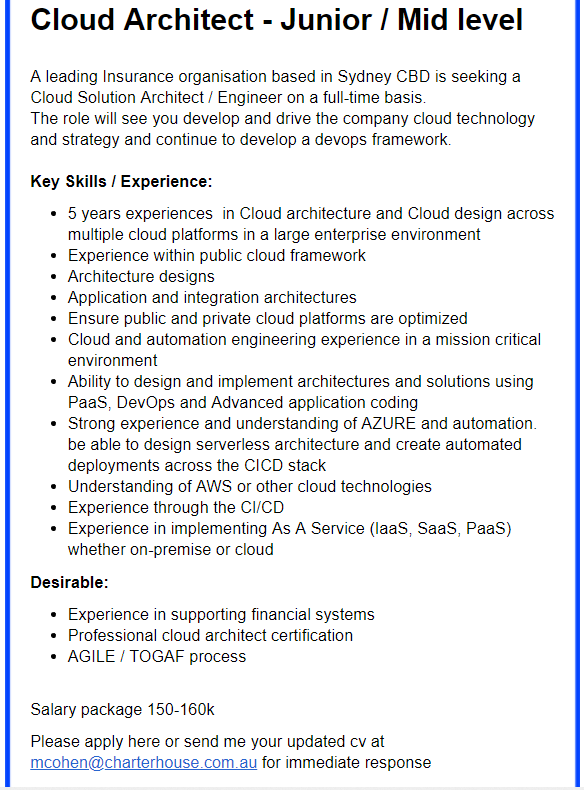

# Welcome to My Profile

## 1.Personal Information

To start with, my name is YIYANG XIANG, but you can just call me Tony, considering my Chinese name is hard to pronounce. According to the requirements, I need to give some basic information about myself. So here we are.

Student number: S3752182

Email address: s3752182@student.rmit.edu.au,
xyy25957627366@gmail.com(personal)

 Nationality: China

 

Hobbies: 
Watching movies has always been my go to activity for all occasions. My love for movies start with Avatar, I remember I was ten years old when I first saw this movie on a Pirated CD because the movie was so popular at the time and the cinema was not as universal as it is now, but anyway I was still impressed by the fancy special effects and fascinating story. Avatar really opened another world for me. Additionally, basketball is one of my biggest interests, love watching NBA, big fan of GOLDEN STATE WARRIORS.

<h2>2.Interest in IT </h2>
<h3>
●What is your interest in IT?
 </h3>
 
 
Well, I enjoy programming, especially, it gives me a sense of satisfaction when I accomplished a small project or a program.  

<h3>
●When did your interest in IT start? 
  </h3>

 
Back in high school, it starts with a little programming  project “Hello World!”. I followed my teacher step by step and I still remember the feeling when “Hello World!” appeared on my computer screen, it’s so unreal like the computer in front of me is alive and I just find the right language to communicate with him.

<h3>
●Outline your IT experience (if any).
</h3>

I learned a very basic programming language called visual basic back in high school. And I started to learn c++ on online courses by myself this year. And if you count game as IT experience well I have played lots of them, CS, CF, LOL, GTA (1,2,3,4,5)…

<h3>
● Why did you choose to come to RMIT?
</h3>

Well, after I finish my college entrance examination, I chose to study abroad. And rmit sent me an offer without the need to attend Foundation which takes almost a year as long as I pass the IELTS test. Besides, studying abroad is really an eye- opening journey.

<h3>
● What do you expect to learn during your studies?
</h3>

I want to learn more programming languages and develop multiple  ways in terms of solving the problems. And learn to work as a group, develop some valuable skills that  I may need in my future career.

<h2>3.Ideal Job</h2>

 My ideal job is cloud architect.

 

 
link: https://www.seek.com.au/job/39631223?searchrequesttoken=b83e4095-7062-4da6-aae4-9abfcee6cdbb&type=standard

The responsibility of the cloud computing architect is to oversee the company's cloud computing strategy, including cloud adoption planning, cloud application design, cloud management and monitoring, as well as overseeing the application architecture and its deployment in the cloud environment, including public clouds, private clouds. In addition to the hybrid cloud, cloud architects are professional consultants throughout the organization and must have a keen sense of the latest developments in cloud computing.Besides this job requires a bachelor of  computer science degree, which is not my current major so I may transfer my major into CS next semester. 

Frankly speaking, I just know the existence of this job but I was attracted by this job as I know this job can earn six-figure salary. But of course, I’m not qualified for this job now as I only have the experience of a few programming languages and almost zero working experience. In order to get this job, I need to have lots of experience both academically and socially. 
So during my school time I need to take my homework seriously and actively participate in group cooperation projects.Besides this job is highly skilled required so I need to take the initiative to learn and make full use of my spare time. And hopefully when I graduate I can get a job as an assistant for a cloud architect or I will take an Internship in a  related companies in order to gather more working experience and learn some valuable lessons from senior. Otherwise I might consider studying further to polish my skills and get a master's degree.

 

