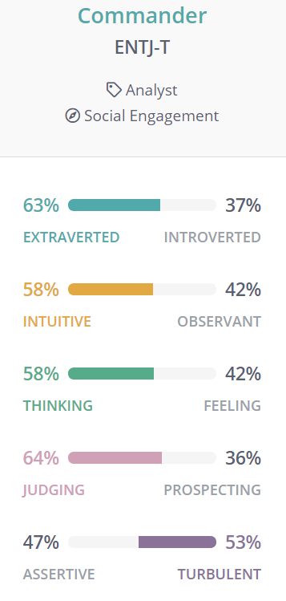
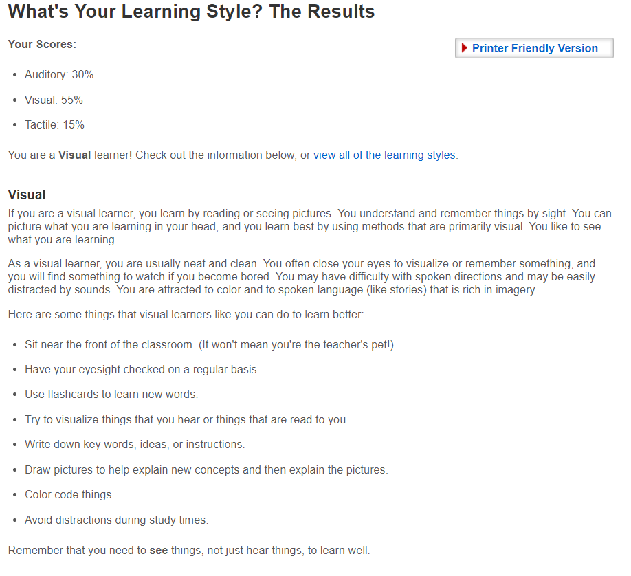
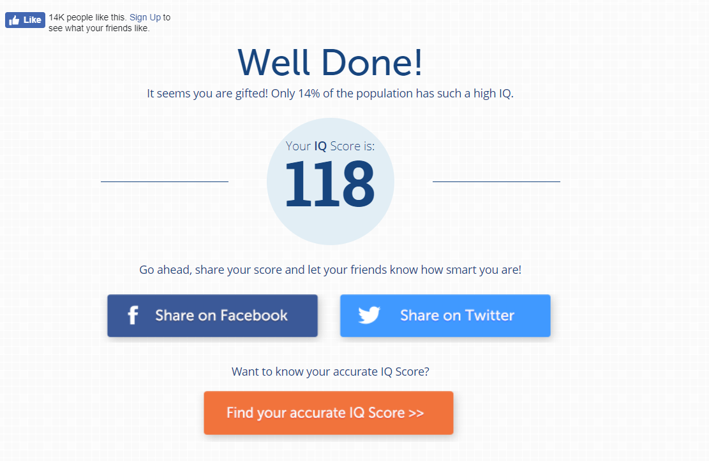

# Welcome to My Profile

## 1.Personal Information

To start with, my name is YIYANG XIANG, but you can just call me Tony, considering my Chinese name is hard to pronounce. According to the requirements, I need to give some basic information about myself. So here we are.

Student number: S3752182

Email address: s3752182@student.rmit.edu.au,
xyy25957627366@gmail.com(personal)

 Nationality: China

 

Hobbies: 
Watching movies has always been my go to activity for all occasions. My love for movies start with Avatar, I remember I was ten years old when I first saw this movie on a Pirated CD because the movie was so popular at the time and the cinema was not as universal as it is now, but anyway I was still impressed by its fancy special effects and fascinating story. Avatar really opened a
 whole new world for me. Additionally, basketball is one of my biggest interests, love watching NBA, big fan of GOLDEN STATE WARRIORS.
  

   

 
 

<h2>2.Interest in IT </h2>
<h3>
●What is your interest in IT?
 </h3>
 
 
Well, I enjoy programming, especially, it gives me a sense of satisfaction when I accomplished a small project or a program.  

<h3>
●When did your interest in IT start? 
  </h3>

 
Back in high school when we were still learning VB，it starts with a little programming  project “Hello World!”. I followed my teacher step by step and I still remember the feeling when “Hello World!” appeared on my computer screen, it’s so unreal like the computer in front of me was alive and I just find the right language to communicate with him.

<h3>
●Outline your IT experience (if any).
</h3>

I learned a very basic programming language called visual basic back in high school. And I started to learn c++ on online courses by myself this year. And if you count game as IT experience well I have played lots of them, CS, CF, LOL, GTA (1,2,3,4,5)…So that's it.

<h3>
● Why did you choose to come to RMIT?
</h3>

Well, after I finish my college entrance examination, I chose to study abroad. And rmit sent me an offer without the need to attend Foundation as long as I pass the IELTS test. Besides, studying abroad is really an eye- opening journey.

<h3>
● What do you expect to learn during your studies?
</h3>

I want to learn more programming languages and develop multiple  ways in terms of solving the problems. And learn to work as a group, and develop some valuable skills that I may need in my future career.

<h2>3.Ideal Job</h2>

 My ideal job is cloud architect. 

Advertisement：

 

 
link: https://www.seek.com.au/job/39631223?searchrequesttoken=b83e4095-7062-4da6-aae4-9abfcee6cdbb&type=standard

The responsibility of the cloud computing architect is to oversee the company's cloud computing strategy, including cloud adoption planning, cloud application design, cloud management and monitoring, as well as overseeing the application architecture and its deployment in the cloud environment, including public clouds, private clouds. In addition to the hybrid cloud, cloud architects are professional consultants throughout the organization and must have a keen sense of the latest developments in cloud computing.Besides this job requires a bachelor of computer science degree, which is not my current major so I may transfer my major into CS next semester. 

Frankly speaking, I just know the existence of this job but I was attracted by this job as soon as I know this job can earn six-figure salary. But of course, I’m not qualified for this job now as I only have the experience of a few programming languages and almost zero working experience. In order to get this job, I need to have lots of experience both academically and socially. 
So during my school time I need to take my homework seriously and actively participate in group cooperation projects.Besides this job is highly skilled required so I need to take the initiative to learn and make full use of my spare time. And hopefully when I graduate I can get a job as an assistant for a cloud architect or I will take an Internship in a  related companies in order to gather more working experience and learn some valuable lessons from senior. Otherwise I might consider studying further to polish my skills and get a master's degree.

 

<h2>4.Personal Profile </h2>
<h3>online Myers Briggs test </h3>

<h3>Online learning style test</h3>

<h3>Online IQ test</h3>

●What do the results of these tests mean for you?

To be honest, I don’t think these tests are very accurate. Especially the IQ test，I dont't think that I am gifted and only 14% of the population has such a high IQ. However, this result is very encouraging, and it helps me to Improve my self-confidence.

● How do you think these results may influence your behaviour in a team?

As I said before, these tests are not accurate enough, considering there are only very limited questions. Therefore, I don't care very much about the results no matter they are good or bad, but of course, some points are realistic, like I need to be more active in a team work.

●How should you take this into account when forming a team?

Well, I won't formate a team with people who are very lazy and irresponsible, because these people often fail to complete the tasks assigned to them and drag the progress of the entire group.
  
<h2>5.Project ideas </h2>

The project I want to design is aimed to make the payment much more convenient all over the world. This application can meet the need of users for fast payment. Every user has their own unique QR code. And they can bind multiple bind to these cards and set a payment password. So now the preparation is ready, users can finish their payment by scanning other user’s QR code. Actually, this kind of application is already exist in China, but I want to make it more influential make it an international application which means I need to add an exchange rate conversion system that convert one type of currency to another currency immediately according to the latest exchange rate. 

I firmly believe that this application can bring tons of convenient to people’s day to day life. First of all its simple and fast, during the shopping，by using this application to pay the checkout, the process can be completed in just 3 seconds, saving a lot of time wasted due to waiting in line, changing the time, etc., making shopping more comfortable. Secondly, merchants can effectively avoid the drawbacks of counterfeiting and cashier cheating by collecting money through electronic money. What’s more, losing the bank card can be very frustrating. According to new Commonwealth Bank data, “more than 689,000 people reported their debit or credit cards stolen over the past 12 months, equating to roughly 1,800 every day – and that’s just for CommBank customers.” However, as long as you use this application there is no need to bring your bank card with you. And for travelers, this application helps them avoid the complicated currency-exchange process. 

This application is designed to have internationally influential. Hence one biggest feature of this application is that it has to have a large number of users. And in order to attract users as much as possible I need to make this application pluralistic，which means I will put more powerful features besides payment into it. Such as movie- watching, online-shopping and online-chatting. Feature number two is convenience. For the convenience of use, people use this application to bind their own bank card or credit card to their own micro-signal. When paying, you can enter the payment password through the mobile phone to complete the payment. The operation is simple and fast. When the user needs to pay, he only needs a mobile phone, and can pay anywhere, anytime, without carrying money, avoiding the trouble of small change when paying, improving the convenience of shopping, reducing the time for checkout, and changing the cumbersome lifestyle. At the same time, the merchant's payment can be quickly arrived, greatly simplifying the business transaction.  
 

In order to complete this application successfully, I need to prepare suitable tools and technologies.
To start with I need “Sketch” which can help me with icon and interface design and I may use “Rational Rose” as my Modeling tool. Then of course I will use “JAVA” to program this application, considering its the programming language that I am currently learning. And after I finish my programming I will use “WinRunner” as my software testing tool. In the end, I will publish my application on “google market”, because it's the world's largest publishing platform. As for the hardware I need to purchase as much RAM as possible (minimum 8GB) and I also need Core i3 Processor at least.Honestly, I only have a superficial understanding of tools that I mentioned above. So I need to learn all of them from scratch and with the help of the internet I can find almost all the information I need and learn from others' experiences by watching the related videos on Youtube. And by developing an application I can accumulate some valuable experience and improve my self-learning ability, laying the foundation for my future employment.

Programming skills is the most required skill in terms of developing an application and Java is a very common and widely used programming language. And in order to enable my programming skills to be able to develop an application，I need to make an effective learning plan. Firstly, I found some understandable online courses about Java, however, video tutorials can't be used as the whole part of self-study, because the knowledge points inside the video are understood by lecturers, and it is not conducive to independent thinking. So after the video is introduced, I should return to the traditional textbook immediately, because in this process, my brain will have a non-stop thinking process, and some doubts will be generated immediately. This will be very helpful for cultivating my own knowledge system. Because the establishment of the knowledge system requires a long process of accumulation, thinking can speed up the process of setting up knowledge system.

Now, let’s go back to this application, what may happen if this application is successfully developed and achieve big success globally. First thing that comes to my mind is this application will promote the development of tourism. Tourists can have much more convenient way of payment, which can save them lots of time to change the money and avoid the trouble of changing money.Therefore, more and more people may start to consider travel internationally. Besides, with the help of this application, International economic exchanges will become more frequent than ever and promoting the economic integration. As for the drawbacks, people may rely more and more on smartphones and they can do nothing if they lost their phone. And safety is another issue, the convenience brought by fast payment also brings convenience to online fraud. But in general, I think the benefits of this application outweigh its disadvantages.

